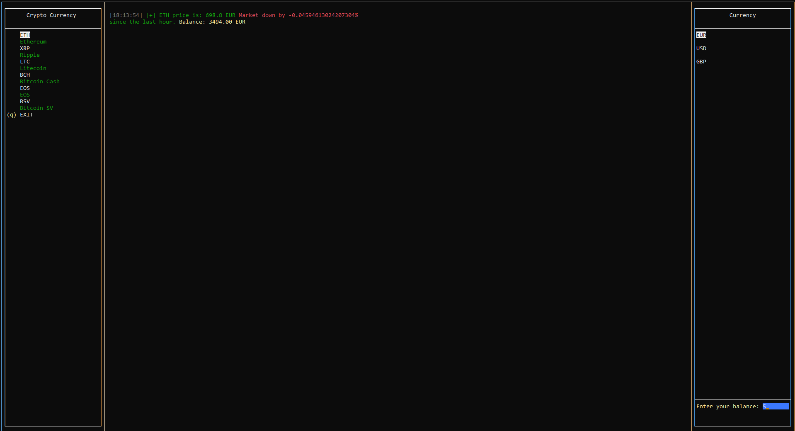

# Coinbase Crypto Monitor

>This application is a rewrite of the same application made in Python. You can find the original app [here](https://github.com/rootsh3l1/coinbase-api-monitor)



* Please consider that the app is only in Beta and you may encounter errors while using it feel fre to submit issues and enchantment requests.

#Index
- [Releases](#release-history)
- [Installation](#installation)
- [Deployment setup](#deployment-setup)
- [Meta](#meta)
- [Contributing](#contributing)


#Release History
* 0.1 First Release

# Installation

```bash
git clone https://github.com/Polliog/cryptocurrency-monitor.git && cd cryptocurrency-monitor
```

# Deployment setup
First you need to install [tview](https://github.com/rivo/tview)

```
go get github.com/rivo/tview
```

After you can proceed to run the app

```
go run main.go
```
#Meta
Distributed under the [MIT License](https://github.com/rivo/tview/blob/master/LICENSE.txt) license. See `LICENSE` for more information.

https://github.com/Polliog/cryptocurrency-monitor

#Contributing

1. **Fork** the repo on GitHub (https://github.com/Polliog/cryptocurrency-monitor/fork)
2. **Clone** the project to your own machine
3. **Commit** changes to your own branch
4. **Push** your work back up to your fork
5. Submit a **Pull request** so that we can review your changes